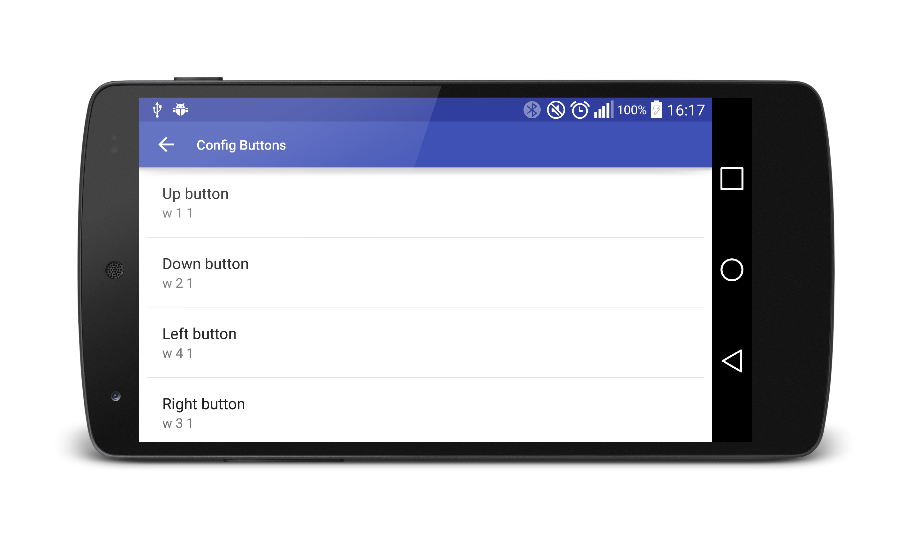
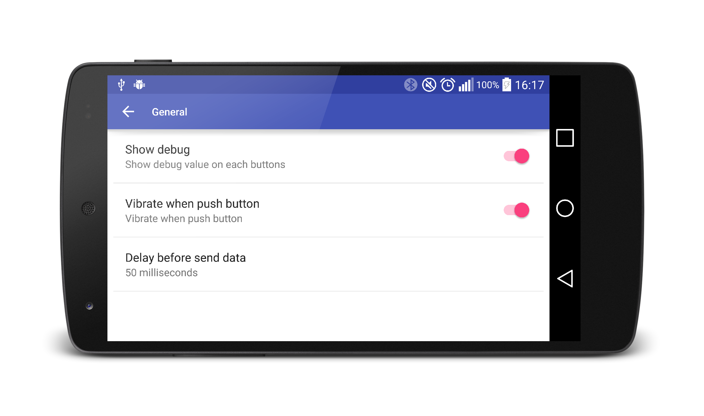
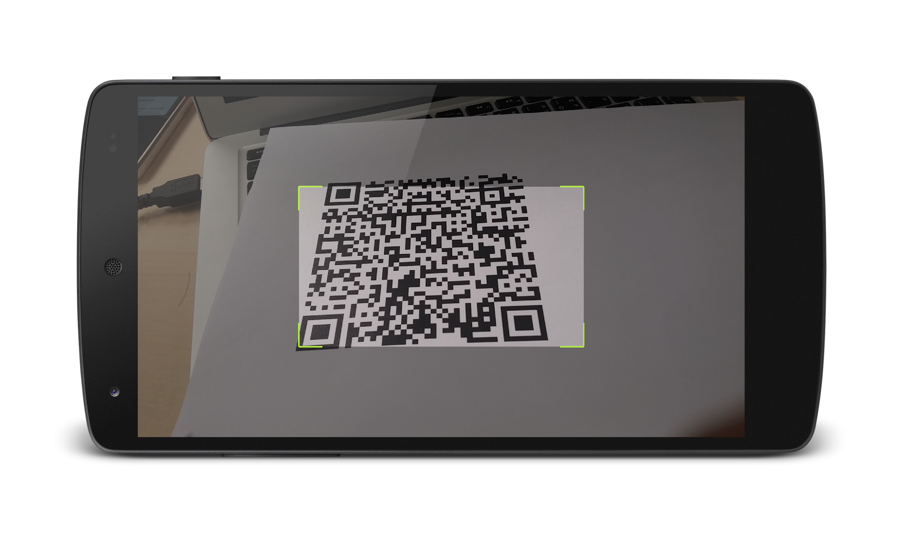
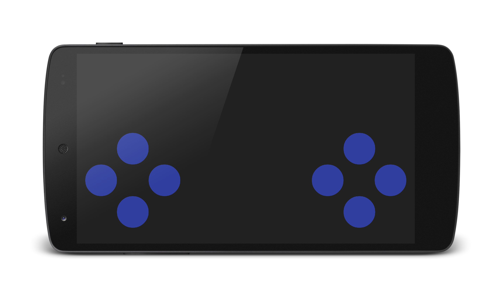
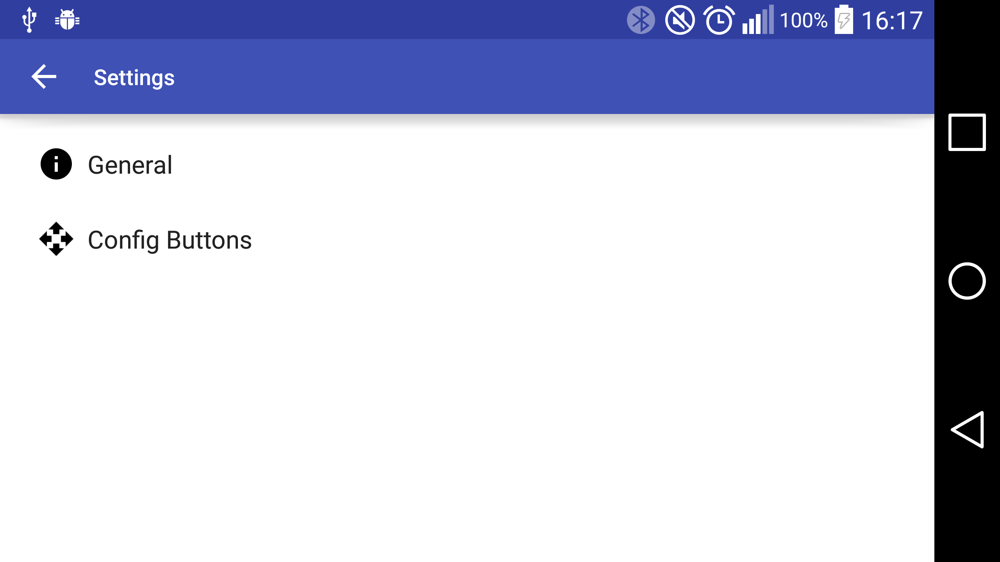

# Android Bluetooth Joypad
Joystick app to control a robot over Bluetooth.

A demo video of the app can be found [here](https://drive.google.com/open?id=0B3lPRdhows9ATnFwX2w3UmVPc2M).

## Feature
  * video overlay through integration with IPwebcam [IPwebcam](https://play.google.com/store/apps/details?id=com.pas.webcam&hl=en)
  * Normal Joypad 4 direction and 4 buttons
  * Configurable buttons.
  * Quick setting using QRCode scanner.
  * Vibrate on click.
  * Debug mode.

## Screenshot

     

         

 

 
